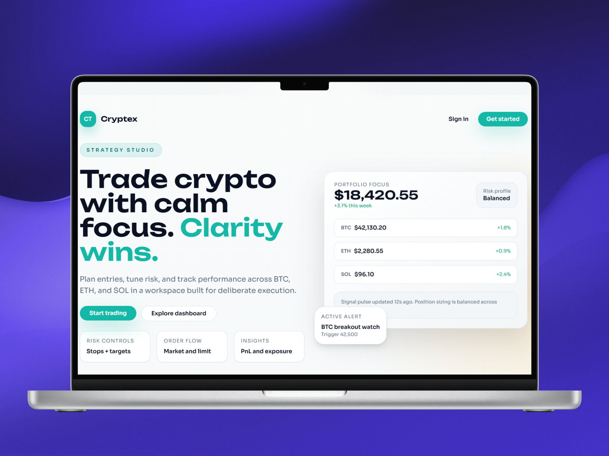
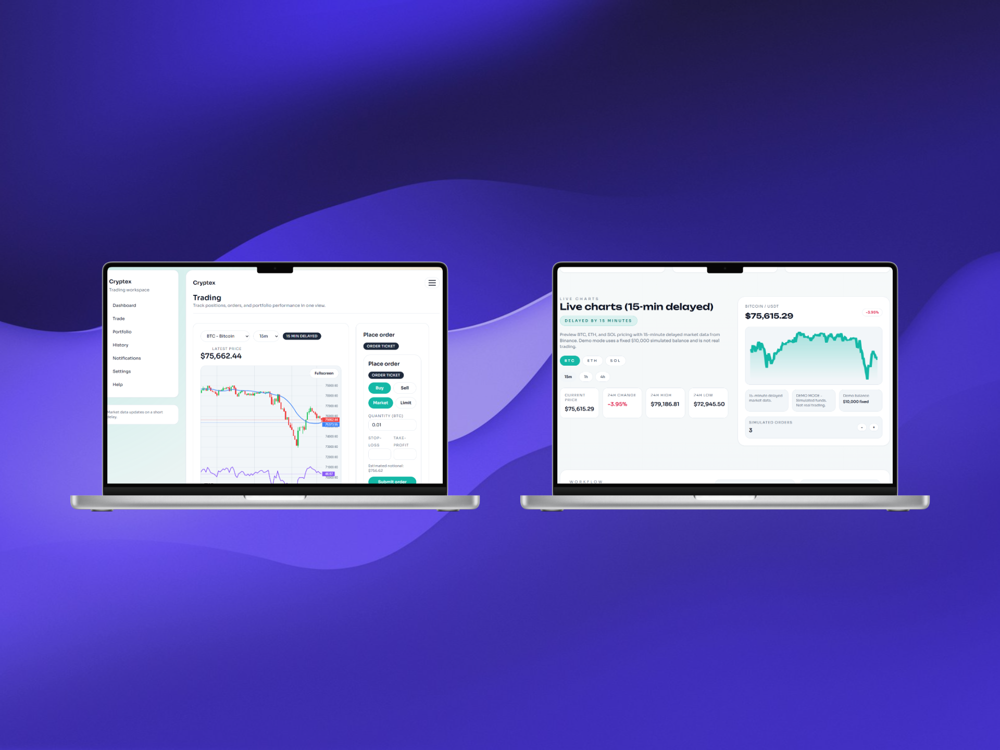
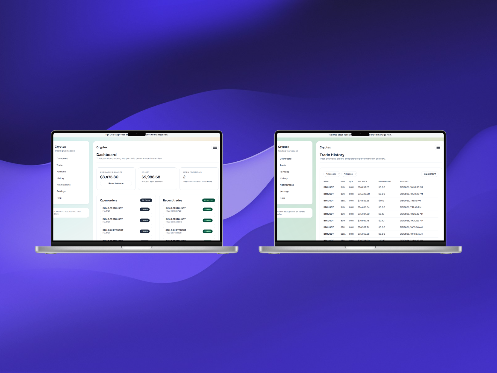
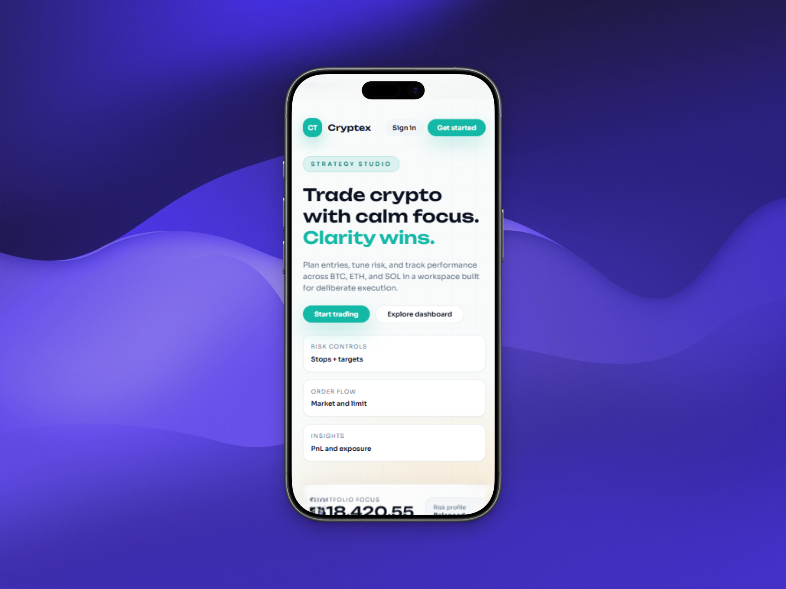
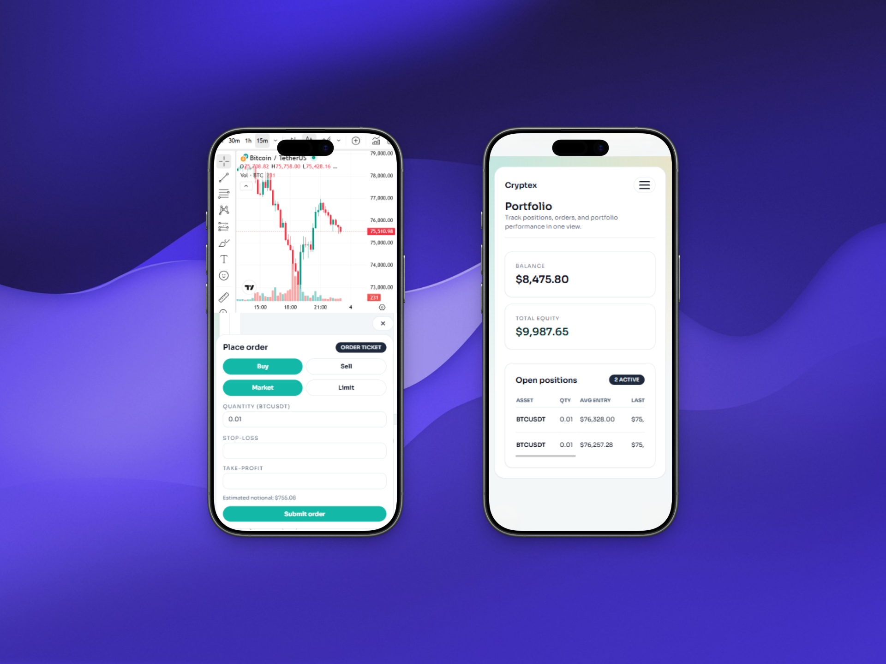

# Cryptex
A modern, responsive crypto trading platform with real-time charts, live pricing, portfolio tracking, and secure authentication. Features an intuitive trading interface, advanced charting, and a clean, professional design.
<br>
The site is live at https://erionsfarqa.github.io/Portofolio/

## Project Screenshots

<div align="center">
  <p>Desktop views of the website</p>
  
  
  
  <br>
  <p>Mobile views of the website</p>
  
  
  
</div>

Demo-only crypto trading platform built with Next.js App Router, Supabase (Auth + Postgres), and TanStack Query.  
**No real trading. No deposits. No withdrawals. Market data is delayed by 15 minutes.**

## Features
- Email/password auth + Google OAuth (optional)
- Email verification + password reset (Resend)
- Demo balance ($10,000) with 24h reset cooldown
- Market + limit orders with stop-loss / take-profit
- Portfolio + P&L tracking
- In-app notifications
- Admin panel for user management and demo resets
- CSV export for closed trades
- Mock or provider-backed market data (Binance)

## Tech Stack
- Next.js App Router + TypeScript + Tailwind
- Supabase Auth (Email/Password + Google)
- Supabase Postgres (no Prisma)
- TanStack Query
- Zod validation
- Chart.js financial candlestick chart

## Setup
1) Install dependencies  
```
npm install
```

2) Configure env vars  
Copy `env.example` to `.env.local` and fill in values:
- `NEXT_PUBLIC_SUPABASE_URL`
- `NEXT_PUBLIC_SUPABASE_ANON_KEY`
- `SUPABASE_SERVICE_ROLE_KEY` (optional; enables admin99 without requiring a signed-in admin)
- `ADMIN_EMAILS` (optional, comma-separated allowlist for admin role)
Restart the dev server after any `.env.local` changes.

3) Start the app  
```
npm run dev
```

## Supabase Notes
- Enable Google provider in Supabase Auth.
- Add redirect URL(s): `http://localhost:3000/auth/callback` (and your production domain).
- Supabase Auth stores users in `auth.users` automatically; you do not need a custom users table.
- Run `supabase/schema.sql` in the Supabase SQL editor to create `profiles` + `account_settings` + RLS.

## Admin testing
- Set `ADMIN_EMAILS="admin@example.com,other@company.com"` in `.env.local`.
- Sign up or sign in with one of those emails.
- The user profile is created on first login; matching emails get `role = ADMIN`.
- If you prefer manual control, update `public.profiles.role` in Supabase.

## Market Data
- Market endpoints proxy Binance with automatic fallback from `api.binance.com` to `api.binance.us`.
- Optional overrides: `MARKET_DATA_BASE_URL`, `MARKET_DATA_FALLBACK_BASE_URL`, `MARKET_DATA_TIMEOUT_MS`.
- Responses are cached at the edge for 10-30s to reduce upstream rate limits.

## Notes
- Demo mode only. Not real trading.
- Market prices are delayed by 15 minutes.
- Limit orders fill when crossed by the latest delayed price.
- Stop-loss / take-profit are matched by the background matcher (`/api/trade/match`), called every 30 seconds on the trading screen.

## Useful Commands
- `npm run dev`
- `npm run build`